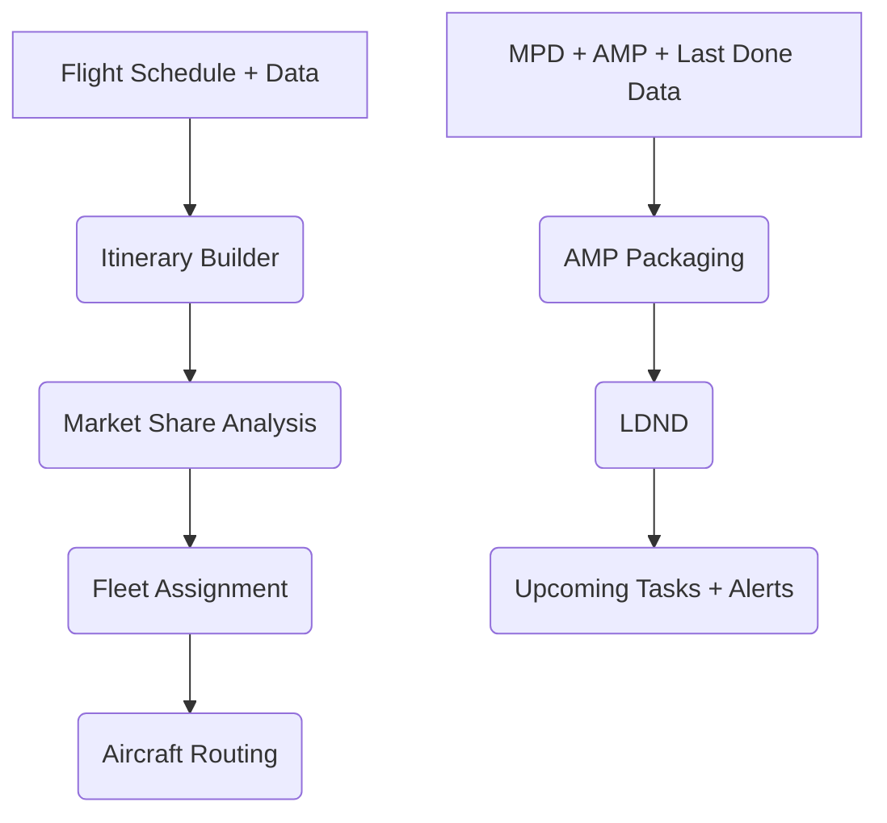

  

  
  
  

# 🌍 SkyLinker AirService ✈️

**Optimizing Airline Schedules & Maintenance Management with Data-Driven Intelligence**

---

## 📌 Overview

SkyLinker AirService is an **integrated decision-support software** that unifies **airline schedule optimization** and **aircraft maintenance management**.  
Developed as a Cairo University Aeronautical Engineering graduation project (Spring 2024), it empowers airlines to **maximize profitability, ensure safety, and streamline operations**.

  

---

## 🚀 Applications

### 1. ✈️ Itinerary Builder
* **Generates:** Non-stop, single-stop, and double-stop itineraries.  
* **Importance:** Enables competitive, passenger-friendly scheduling.  

  

---

### 2. 📊 Market Share Analysis
* **Generates:** Demand forecasts, competitor shares, and HHI index.  
* **Importance:** Provides airlines with **strategic insights** on market entry/expansion.  

  

---

### 3. 🛫 Fleet Assignment (FAM / IFAM / ISD-IFAM)
* **Generates:** Optimal fleet allocation with profit/cost outputs.  
* **Importance:** Ensures **resource efficiency & maximum revenue**.  

  

---

### 4. 🔄 Aircraft Routing
* **Generates:** Daily rotation plans integrating turnaround times & maintenance.  
* **Importance:** Guarantees **smooth, feasible operations**.  

  

---

### 5. 🛠️ Operator & Aircraft Data Pages
* **Centralizes:** Airline, aircraft, and engine details.  
* **Importance:** Forms the **foundation for all maintenance modules**.  

  

---

### 6. 📂 Admin Panel – AMP (Approved Maintenance Program)
* **Generates:** Structured, packaged MPD tasks.  
* **Importance:** Automates compliance, reducing human error.  

  

---

### 7. ⏳ LDND (Last-Done Next-Due)
* **Calculates:** Next due dates by flight hours, cycles, and dates.  
* **Importance:** Ensures **safe, timely maintenance**.  

  

---

### 8. 📅 Upcoming Tasks & Mailing System
* **Generates:** Forecasts for future maintenance + automated email alerts.  
* **Importance:** Keeps operators **ahead of deadlines**, preventing costly delays.  

  

---

## 🛠️ Tech Stack

* **Backend**: Python + Django  
* **Frontend**: Web-based UI (HTML, CSS, JS, jQuery)
* **Database**: Structured relational data  
* **Models**: Regression, Poisson forecasting, fleet optimization solvers  
* **Cloud**: Hosted on EC2

---

## 📂 Workflow

---

## 👨‍💻 Authors

Developed by **Cairo University Aeronautical Engineering Students (Class of 2024)**:

* Sara Ehab Eshak Azmi
* Mariam Hesham Mostafa Khalil
* Mohannad Hossam Hosny Hammad
* Eslam Mahmoud Hanafy Mahmoud
* Abdullah Mohamed Abdullah Kamel

**Supervised by:** Dr. Mohamed Lotfy Taha Hassan

---

## 📜 License

This project is an **academic graduation project**. For research and educational use only.

---

  <b>✈️ SkyLinker: Linking skies with intelligence and safety. ✈️</b>

