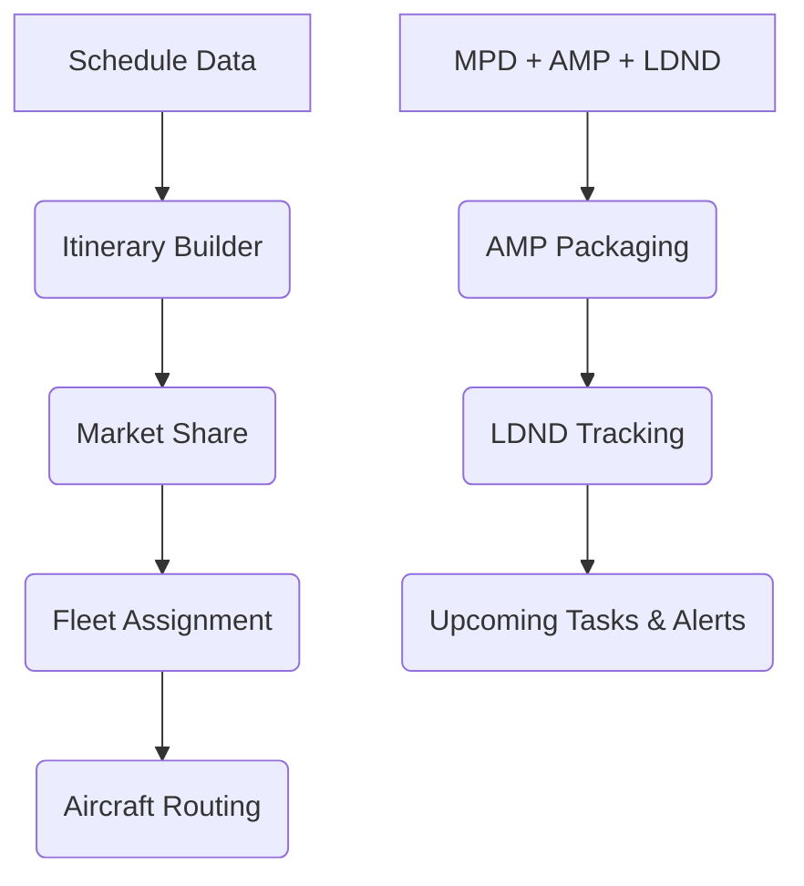

# ✈️ SkyLinker – Airline Operations & Maintenance Intelligence  

---

## 🌍 **Project Overview**  

**🔥 A complete airline decision-support system 🔥**  
*🚀 Unifying **schedule optimization**, **fleet assignment**, **aircraft routing**, and **predictive maintenance** into one powerful platform.*  

  

SkyLinker was developed as a **Cairo University Aeronautical Engineering graduation project (2024)** to help airlines:  

- 📈 **Maximize profitability** through optimized schedules  
- 🔧 **Ensure safety** via predictive maintenance  
- 🛫 **Enhance efficiency** with data-driven fleet operations  

---

## 📈 **Business Impact** 💼  

### 🎯 **Key Benefits for Airlines**
- **⚡ Operational Efficiency**: Optimize itineraries, aircraft assignments, and turnaround times.  
- **🛡️ Safety Compliance**: Automate maintenance programs, LDND tracking, and AMP packaging.  
- **💰 Profitability Boost**: Forecast demand, analyze market share, and allocate fleets for maximum return.  
- **🔮 Predictive Maintenance**: Stay ahead of due tasks with automatic alerts and email notifications.  

### 👥 **Target Users** 🎯  

✈️ **Airline Operators & Planners**  
🛠️ **Maintenance Engineers & Technicians**  
📊 **Aviation Analysts & Consultants**  
🏛️ **Civil Aviation Authorities**  

---

## 🚀 **Applications**  

### ✈️ **Itinerary Builder**
- 📝 Generates **non-stop, single-stop, and double-stop** itineraries  
- 🎯 Helps airlines design competitive routes  

### 📊 **Market Share Analysis**
- 📈 Forecasts demand, competitor shares, and HHI index  
- 🔍 Strategic tool for market entry and expansion  

### 🛫 **Fleet Assignment (FAM / IFAM / ISD-IFAM)**
- ⚙️ Assigns aircraft optimally with profit/cost outputs  
- 💰 Ensures efficient resource allocation  

### 🔄 **Aircraft Routing**
- 📅 Builds feasible daily rotations with turnaround times & maintenance slots  
- 🚦 Guarantees smooth operations  

### 🛠️ **Maintenance Management Modules**
- **AMP (Approved Maintenance Program)** → packages MPD tasks for compliance  
- **LDND (Last Done – Next Due)** → calculates next due tasks  
- **Upcoming Tasks & Alerts** → forecasts future checks + automated email alerts  

---

## 📊 Workflow  

---

## 🎛️ **Dashboards & Interfaces**  

### **🌐 Web Interface**
- Django-based responsive interface for planners & engineers  
- Easy navigation across scheduling and maintenance modules  

### **📊 Analytical Dashboards**
- **Demand Forecasting & Market Share** → visualize route demand & competitor analysis  
- **Fleet Assignment Outputs** → compare profit, utilization, and efficiency across scenarios  
- **Aircraft Routing** → daily aircraft rotation with maintenance slot integration  

### **🛠️ Maintenance Control Panels**
- **AMP Packaging** → centralized MPD → AMP conversion  
- **LDND Tracking** → automatic updates of last-done / next-due tasks  
- **Upcoming Tasks & Alerts** → proactive notifications with email integration
  
### **📖 Documentation **
- You can view the full website manual here:  
- [➡️ Open the PDF](media/SkyLinker Manual- FinalV.pdf)
---

## 🚀 **Key Technical Challenges & Solutions** 💪  

### **⚡ Performance Optimization**  
- Designed efficient fleet optimization solvers for large-scale route data  
- Integrated **Poisson forecasting & regression** for demand prediction  

### **🛡️ Reliability Engineering**  
- Guaranteed **seamless integration** between modules, ensuring that the output of each optimization stage (e.g., itinerary → market share → fleet assignment → routing → maintenance) is **validated, consistent, and immediately usable** as the input for the next module.  
- Ensured database consistency and integrity for maintenance records  

### **📈 System Scalability**  
- Built modular applications (Scheduling + Maintenance as independent apps)  
- Cloud-ready with **Docker** for deployment in scalable environments  

---

## 🔮 Future Work  

To further enhance SkyLinker AirService and extend its real-world applicability, the following modules are planned for future development:  

- **🎟️ Ticket Pricing Module**  
  - Dynamic pricing strategies based on demand forecasting, competition analysis, and seasonal variations.  
  - Helps maximize revenue while maintaining passenger satisfaction.  

- **👨‍✈️ Crew Assignment Module**  
  - Optimal allocation of pilots and cabin crew considering duty time limitations, legal regulations, and cost efficiency.  
  - Ensures both **safety compliance** and **efficient workforce utilization**.  

- **⛽ Fuel Optimization Module**  
  - Intelligent planning to minimize fuel consumption across routes and aircraft types.  
  - Contributes to **cost reduction** and **environmental sustainability** by lowering emissions.  

---

## 👨‍💻 **Project Team** 🏆  

🎓 Cairo University – Aeronautical Engineering (Class of 2024) 

| 👤 **Team Member** | 🛠️ **Role** | 🔗 **LinkedIn Profile** |
|-------------------|-------------|------------------------|
| **🎨 Sara Ehab Eshak Azmi** | Frontend Developer |  |
| **⚙️ Mariam Hesham Mostafa Khalil** | Backend Developer |  |
| **🔀 Mohaned Hossam Hosny Hammad** | Fullstack Developer |  |
| **⚙️ Eslam Mahmoud Hanafy Mahmoud** | Backend Developer |  |
| **🧪 Abdullah Mohamed Abdullah Kamel** | Testing & QA |  |

### 🙌 Special Thanks  

    
| 👤 **Contributor** | 🛠️ **Role** | 🔗 **LinkedIn Profile** |
|-------------------|-------------|------------------------|
| **🎓 Dr. Mohamed Lotfy Taha Hassan** | Project Supervisor & Guider |  |
| **💡 Eng. Hesham Ahmed** | Project Mentor & Technical Support |  |

🤝 *Teamwork makes the dream work!* ✨  

---

## 📜 **License**  

This project is an **academic graduation project**.  
For research and educational use only.  

---

**✈️ SkyLinker – Linking Skies with Intelligence and Safety 🌍**  
